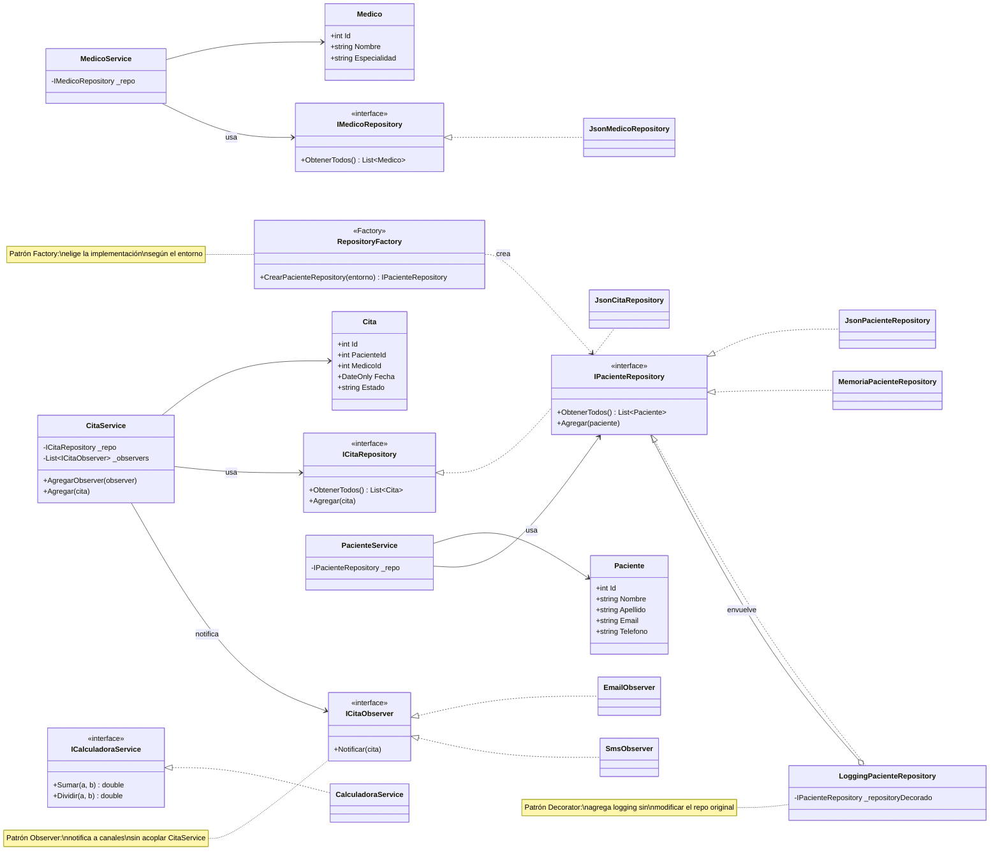

```mermaid
classDiagram
    direction LR

    %% ===== DOMAIN =====
    class Paciente {
        +int Id
        +string Nombre
        +string Apellido
        +string Email
        +string Telefono
    }
    class Medico {
        +int Id
        +string Nombre
        +string Especialidad
    }
    class Cita {
        +int Id
        +int PacienteId
        +int MedicoId
        +DateOnly Fecha
        +string Estado
    }

    class IPacienteRepository {
        <<interface>>
        +ObtenerTodos() List~Paciente~
        +Agregar(paciente)
    }
    class IMedicoRepository {
        <<interface>>
        +ObtenerTodos() List~Medico~
    }
    class ICitaRepository {
        <<interface>>
        +ObtenerTodos() List~Cita~
        +Agregar(cita)
    }
    class ICitaObserver {
        <<interface>>
        +Notificar(cita)
    }
    class ICalculadoraService {
        <<interface>>
        +Sumar(a, b) double
        +Dividir(a, b) double
    }

    %% ===== APPLICATION =====
    class PacienteService {
        -IPacienteRepository _repo
    }
    class MedicoService {
        -IMedicoRepository _repo
    }
    class CitaService {
        -ICitaRepository _repo
        -List~ICitaObserver~ _observers
        +AgregarObserver(observer)
        +Agregar(cita)
    }
    class CalculadoraService

    %% ===== INFRASTRUCTURE =====
    class JsonPacienteRepository
    class MemoriaPacienteRepository
    class LoggingPacienteRepository {
        -IPacienteRepository _repositoryDecorado
    }
    class JsonMedicoRepository
    class JsonCitaRepository
    class RepositoryFactory {
        <<Factory>>
        +CrearPacienteRepository(entorno) IPacienteRepository
    }
    class EmailObserver
    class SmsObserver

    %% ===== Relaciones Domain =====
    PacienteService --> Paciente
    MedicoService --> Medico
    CitaService --> Cita

    %% ===== Implementaciones =====
    IPacienteRepository <|.. JsonPacienteRepository
    IPacienteRepository <|.. MemoriaPacienteRepository
    IPacienteRepository <|.. LoggingPacienteRepository
    IMedicoRepository <|.. JsonMedicoRepository
    ICitaRepository <|.. JsonCitaRepository
    ICitaObserver <|.. EmailObserver
    ICitaObserver <|.. SmsObserver
    ICalculadoraService <|.. CalculadoraService

    %% ===== Composición / Decorator =====
    LoggingPacienteRepository o-- IPacienteRepository : envuelve

    %% ===== Servicios -> Repositorios =====
    PacienteService --> IPacienteRepository : usa
    MedicoService --> IMedicoRepository : usa
    CitaService --> ICitaRepository : usa
    CitaService --> ICitaObserver : notifica

    %% ===== Factory =====
    RepositoryFactory ..> IPacienteRepository : crea

    note for RepositoryFactory "Patrón Factory:\nelige la implementación\nsegún el entorno"
    note for LoggingPacienteRepository "Patrón Decorator:\nagrega logging sin\nmodificar el repo original"
    note for ICitaObserver "Patrón Observer:\nnotifica a canales\nsin acoplar CitaService"
```